
# Projeto POO - Fase 2

## Licenciatura em Engenharia Informática

### POO 2023-24

### Época Normal

[TOC]

## 1. Introdução

O objetivo da segunda fase do presente projeto é desenvolver, utilizando a linguagem Java, o sistema JavaFX e a metodologia da Programação Orientada a Objetos, uma interface gráfica que permita gerir o Sistema Domótico criado
na primeira fase do projeto: criar, apagar, modificar compartimentos e equipamentos dos compartimentos. Deverá ainda ser possível monitorizar e atuar nos equipamentos de um determinado compartimento.

Na descrição seguinte será apresentado um possível aspeto da interface gráfica a desenvolver. Caberá a cada grupo optar uma alternativa gráfica, onde deverão ser mantidas todas as funcionalidades aqui enunciadas.

## 2. Gestão da Consola

O sistema deve permitir gerir toda a informação da consola: seus compartimentos e respetivos equipamentos.

### 2.1. Criação de Compartimentos

A gestão de compartimentos deverá ser feita através de um ecrã próprio:

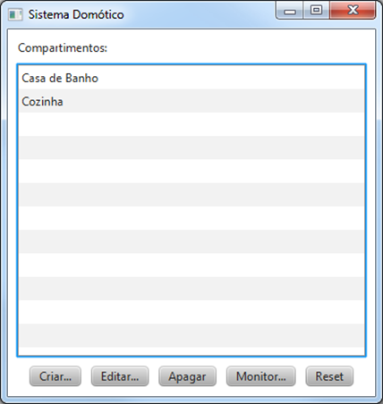

O sistema deve permitir a criação de compartimentos ():

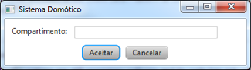

Testando para que não sejam criados compartimentos com designação nula:

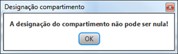

Ou com designação repetida:

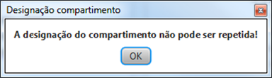

Após a criação do compartimento, deverá ser possível adicionar equipamentos:

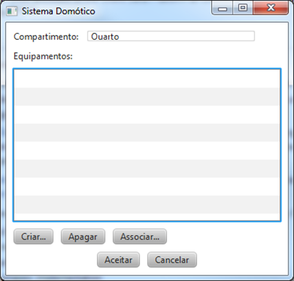

### 2.2. Alteração de Compartimentos

Para os compartimentos já criados, o sistema deve permitir modificá-los ():

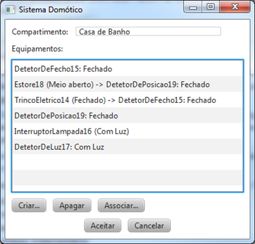

### 2.3. Eliminação de Compartimentos

A eliminação de compartimentos deverá ser possível através do botão próprio (). Antes de se apagar o compartimento deverá ser conveniente pedir uma confirmação:

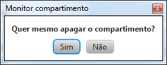

### 2.4. Criação de Equipamentos

No ecrã de edição de um determinado compartimento, o sistema deve permitir a criação de equipamentos
(), escolhendo o seu tipo:

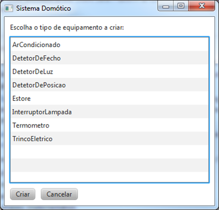

### 2.5. Eliminação de Equipamentos

A eliminação de equipamentos deverá ser possível através do botão próprio ().

Antes de se apagar o equipamento deverá ser conveniente pedir uma confirmação:

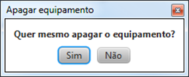

### 2.6. Associação de Equipamentos

Para os equipamentos que são “Atuadores” com “Impacto local” deverá ser possível associar sensores. Tal não deve ser permitido para os restantes tipos de equipamentos:

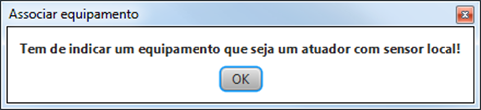

A associação de sensores deverá ser feita através do botão próprio ().
Para esta associação deverão ser apresentados, apenas os sensores do tipo respetivo do atuador e que ainda não estejam associados:

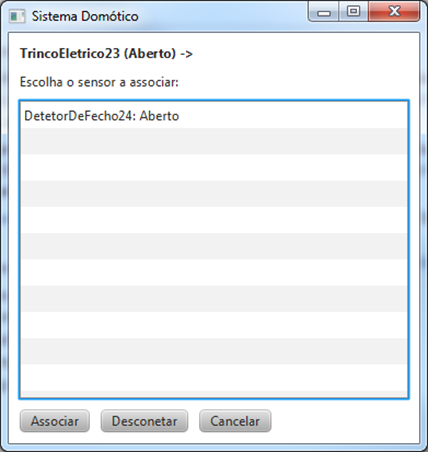

É ainda possível desconetar o sensor do atuador através do botão próprio (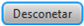). Esta ação deverá ser precedida de uma confirmação:

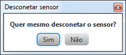

## 3. Monitorização de um Compartimento

Após a escolha de um compartimento deverá ser possível monitorizá-lo (), visualizando os seus atuadores e sensores:

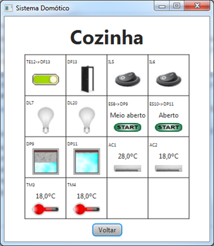

O sistema deve apresentar uma representação gráfica para cada tipo de equipamento (nos exemplos, foi colocado no canto superior esquerdo uma sigla que identifica o tipo de equipamento e o seu identificador):

| Tipo de Equipamento    | Sigla |             Representação              |
| ---------------------- | :---: | :------------------------------------: |
| Termómetro             |  TM   |     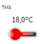     |
| Detetor de Luz         |  DL   |   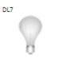   |
| Detetor de Fecho       |  DF   |  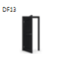  |
| Detetor de Posição     |  DP   | 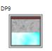 |
| Ar Condicionado        |  AC   |  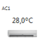   |
| Interruptor de Lâmpada |  IL   |    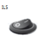     |
| Trinco Elétrico        |  TE   |       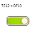       |
| Estore                 |  ES   |       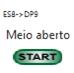       |

### 3.1. Representação dos sensores

Os diversos tipos de sensores devem ter uma representação gráfica que permita ao utilizador saber qual o valor monitorizado.

#### 3.1.1. Termómetro

Nos termómetros é apresentada a temperatura medida, em graus Celsius:

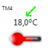

#### 3.1.2. Detetor de Luz

Nos detetores de luz são apresentados os dois estados possíveis:

|  |  |
| :-------------------------: | :-------------------------: |
|           Com Luz           |           Sem Luz           |

#### 3.1.3. Detetor de Fecho

Nos detetores de fecho são apresentados os dois estados possíveis:

|  |  |
| :-------------------------: | :------------------------: |
|           Fechado           |           Aberto           |

#### 3.1.4. Detetor de Posição

Nos detetores de posição são apresentados os cinco estados possíveis:

|  |  |  |  |  |
| :-------------------------: | :--------------------------: | :-----------------------------: | :-----------------------------: | :------------------------: |
|           Fechado           |           Um terço           |           Meio aberto           |           Dois terços           |           Aberto           |

### 3.2. Representação dos atuadores

Nos diversos tipos de atuadores é preciso apresentar o valor que está selecionado e permitir ao utilizador que atue no equipamento.

#### 3.2.1. Ar Condicionado

Nos ar condicionados é possível indicar qual a temperatura desejada, para quando se atuar no equipamento. Tal é feito selecionando, com o rato, sobre o valor da temperatura:

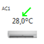

Será depois apresentado um ecrã onde é possível indicar (através do slider ou diretamente na caixa de texto) qual o valor pretendido:

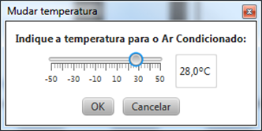

Para ativar o ar condicionado (e ser alterada a temperatura de todos os termómetros do compartimento) basta carregar sobre a figura do “equipamento de ar condicionado”:

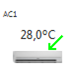

#### 3.2.2. Interruptor de Lâmpada

Os interruptores de lâmpadas são representados por uma imagem de dois botões que indicam o seu estado e, ao serem carregados, passam para o estado seguinte (Desligado &rarr; Ligado &rarr; Desligado), atualizando os sensores de luz do compartimento:

|  |  |
| :---------------------------------: | :------------------------------: |
|              Desligado              |              Ligado              |

#### 3.2.3. Trinco Elétrico

Analogamente, os trincos elétricos são representados por uma imagem de dois botões que indicam o seu estado e, ao serem carregados passam para o estado seguinte (Fechado &rarr; Aberto &rarr; Fechado), alterando o sensor de fecho, a ele acoplado:

|  |  |
| :--------------------------------: | :-------------------------------: |
|              Fechado               |              Aberto               |

#### 3.2.4. Estore

Nos estores é possível indicar qual a posição desejada, para quando se atuar no equipamento. Tal é feito selecionando, com o rato, sobre a indicação da posição:

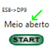

Será depois apresentado um ecrã onde é possível indicar (através da lista de alternativas) qual o valor pretendido:

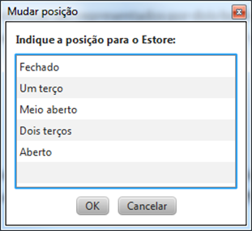

Para ativar o estore (e ser alterado o sensor de posição a ele acoplado) basta carregar sobre o botão “START”:

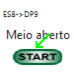

## 4. _Reset_ e armazenamento da consola

A consola tem a função de _Reset_, que, uma vez acionada (), colocará todos os equipamentos, de todos os compartimentos da consola, nos seus valores por omissão. Esta ação deve ser precedida de uma confirmação:

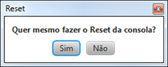

Ao se fazer o _Reset_ da consola os equipamentos ficam nos seus valores por omissão:

| 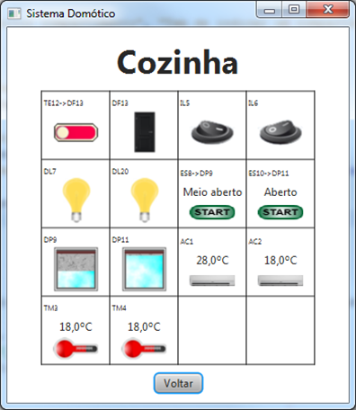 | 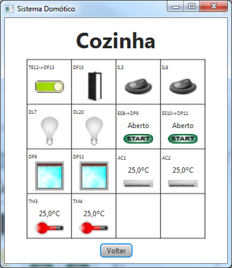 |
| :-----------------------------: | :------------------------------: |
|         Antes do Reset          |         Depois do Reset          |

Para garantir a continuidade de funcionamento dos dados do programa, deverá ser possível gravar para um ficheiro toda a informação associada à consola: conjunto de compartimentos, para cada compartimento os respetivos equipamentos e para cada equipamento o respetivo estado (valor da característica/propriedade, sensor acoplado, etc.). No início do programa deverá ser lida, caso exista, a última configuração gravada. A gravação dos dados é feita quando se termina o programa (através do botão ).

Na interface gráfica apresentada não foram implementadas funcionalidades extras (a manipulação, leitura e gravação de diversas consolas, a criação de um ou mais tipos de equipamentos, etc.). Caso o sistema possua funcionalidades extras deverá ser implementada uma interface gráfica que tire proveito delas.

## 5. Regras no desenvolvimento do projeto

### 5.1. Regras de implementação e codificação

O programa deve ser desenvolvido utilizando a linguagem Java colocando em prática os conceitos fundamentais do paradigma de Programação Orientada por Objetos.

Em relação às regras de codificação siga as convenções adotadas normalmente para a linguagem Java:

- A notação camelCase para o nome das variáveis locais e identificadores de atributos e métodos;
    
- A notação PascalCase para os nomes das classes e interfaces;

- Utilização de maiúsculas para os nomes das constantes e dos valores enumerados;

- Não utilize o símbolo ‘\_’ nos identificadores (exceto nas constantes), nem abreviaturas.

É necessário que o projeto cumpra o que é pedido no seu enunciado, sendo deixado ao critério do programador qualquer pormenor de implementação que não seja referido no mesmo e que deve ser devidamente documentado.

### 5.2. Constituição de grupos

Cada projeto deverá ser elaborado nos mesmos grupos da primeira fase. Caso haja alunos que tenham elaborado a primeira fase individualmente, poderão associar-se, criando um grupo e optando por trabalhar numa das versões entregues na primeira fase. Não serão permitidos em nenhum caso grupos de mais do que dois alunos, nem grupos com alunos que pertençam a turmas de laboratórios com diferentes docentes.

### 5.3. Datas de Entrega

A entrega desta segunda fase do projeto será até às **17:00:00 de sexta-feira, dia 28/06/2024**.

A versão do projeto existente no repositório Github do grupo será extraída automaticamente à hora do fecho. Será esta versão que será avaliada na fase 2.

Todos os materiais do projeto devem ser devidamente identificados com nome, número, turma e endereço de _email_ dos alunos que constituem o grupo. Deverá ainda ser incluído também o nome do professor de laboratório encarregado da avaliação.

Os materiais do projeto incluem:

- Um Manual Técnico onde conste uma breve descrição do programa. Deve acrescentar uma breve explicação das classes/interfaces implementadas;
- A documentação do programa em JavaDoc (não converta o documento gerado automaticamente em HTML para doc);
- O código fonte do programa na forma de projeto, com o um _main_ de testes a funcionar e com todas as funcionalidades implementadas e as respetivas classes de teste.

> Todos os ficheiros que compõem o projeto deverão estar guardados num repositório Github associado ao projeto do grupo.

## 6. Avaliação

As avaliações da segunda fase do projeto serão realizadas na semana de
01 de Julho de 2024.

### 6.1. Regras de Avaliação

- O projeto está dividido em 2 fases. A cotação será distribuída pelas duas fases da
    seguinte forma:

  - Fase I – (70% avaliação final)

  - Fase II – (30% avaliação final)

- A classificação do programa terá em conta a qualidade da programação (fatores de qualidade do software), a estrutura do código criado segundo os princípios da Programação Orientada por Objetos, tendo em conta conceitos como a coesão de classes e métodos, o grau de acoplamento entre classes e o desenho de classes orientado pela responsabilidade, e a utilização/conhecimento da linguagem Java.
    
- Serão premiadas a facilidade de utilização, a apresentação, a imaginação e a criatividade.
    
- O projeto terá uma componente de avaliação escrita obrigatória com classificação individual dos elementos do grupo. No caso da avaliação escrita não ser positiva, o projeto terá uma componente de avaliação oral obrigatória com classificação individual dos elementos do grupo.
    
- Os alunos que não comparecerem à discussão oral serão classificados com zero. Nesta discussão com os alunos será apurada a capacidade do aluno de produzir o código apresentado. Nos casos em que essa capacidade não for demonstrada a nota atribuída será zero.
    
- A avaliação oral é realizada pelo respetivo professor de laboratório e irá ser feita uma marcação prévia para cada grupo de trabalho.
    
- Todos os projetos serão submetidos a um sistema de deteção de cópias automático. Os projetos que forem identificados como cópias e que se verificar serem cópias serão anulados.

### 6.2. Critérios de Avaliação da 2ª fase

|Componente     |Elemento                                                                                                                                                                                                         |Peso (%)|
|---------------|-----------------------------------------------------------------------------------------------------------------------------------------------------------------------------------------------------------------|:------:|
|Funcionalidades|Criar Consola                                                                                                                                                                                                    |2%      |
|Funcionalidades|Criar Compartimento na Consola                                                                                                                                                                                   |2%      |
|Funcionalidades|Validar designação de Compartimento repetida e em falta (na criação e por alteração, depois de criado)                                                                                                           |2%      |
|Funcionalidades|Criar Termómetro                                                                                                                                                                                                 |2%      |
|Funcionalidades|Criar Ar Condicionado                                                                                                                                                                                            |2%      |
|Funcionalidades|Associar Equipamentos a Compartimentos                                                                                                                                                                           |1%      |
|Funcionalidades|Mudar temperatura em Ar Condicionado                                                                                                                                                                             |1%      |
|Funcionalidades|Ativar Ar Condicionado e ver repercussão em, pelo menos dois, Termómetros do Compartimento                                                                                                                       |2%      |
|Funcionalidades|Criar Detetor de Luz                                                                                                                                                                                             |2%      |
|Funcionalidades|Criar Interruptor de Lâmpada                                                                                                                                                                                     |2%      |
|Funcionalidades|Mudar pelo menos dois Interruptores de Lâmpada (Ligar1, Ligar2, Desligar1, Desligar2) e verificar, em cada mudança, como se comportam, pelo menos dois, Detetores de Luz e os respetivos Interruptores de Lâmpada|2%      |
|Funcionalidades|Criar Detetor de Fecho                                                                                                                                                                                           |2%      |
|Funcionalidades|Criar Trinco Elétrico                                                                                                                                                                                            |2%      |
|Funcionalidades|Associar Detetor de Fecho ao Trinco Elétrico                                                                                                                                                                     |1%      |
|Funcionalidades|Atuar Trinco Elétrico e verificar o resultado no Detetor de Fecho e o valor do Trinco Elétrico                                                                                                                   |2%      |
|Funcionalidades|Criar Detetor de Posição                                                                                                                                                                                         |2%      |
|Funcionalidades|Criar Estore                                                                                                                                                                                                     |2%      |
|Funcionalidades|Mudar posição no Estore                                                                                                                                                                                          |1%      |
|Funcionalidades|Associar Detetor de Posição ao Estore                                                                                                                                                                            |1%      |
|Funcionalidades|Atuar Estore e verificar a posição resultado no Detetor de Posição                                                                                                                                               |2%      |
|Funcionalidades|Mudar Equipamento de Compartimento                                                                                                                                                                               |2%      |
|Funcionalidades|Reset do sistema                                                                                                                                                                                                 |1%      |
|Funcionalidades|Ordenação na apresentação                                                                                                                                                                                        |1%      |
|Funcionalidades|Leitura e escrita em ficheiro                                                                                                                                                                                    |1%      |
|Implementação  | Utilização de TextFields                                                                                                                                                                                        |5%      |
|Implementação  | Utilização de Botões                                                                                                                                                                                            |5%      |
|Implementação  | Utilização de ImageViews                                                                                                                                                                                        |5%      |
|Implementação  | Definição e utilização de eventos                                                                                                                                                                               |7%      |
|Implementação  | Definição e utilização de diálogos                                                                                                                                                                              |5%      |
|Implementação  | Utilização de constantes para definição das características da interface                                                                                                                                        |5%      |
|Implementação  | Utilização de herança nos diversos tipos de nodes para especializar a interface ao problema atual                                                                                                               |10%     |
|Implementação  | Separação da interface do modelo de dados                                                                                                                                                                       |10%     |
|Manual Técnico |Descrição da utilização do Programa                                                                                                                                                                              |3%      |
|Manual Técnico |Modelo de análise do programa                                                                                                                                                                                    |5%      |
|Bonificações   |Respeita dos normas de codificação estipuladas                                                                                                                                                                   |5%      |
|Bonificações   |A manipulação, leitura e gravação de diversas Consolas                                                                                                                                                           |5%      |
|Bonificações   |A criação de um ou mais tipos de Equipamentos                                                                                                                                                                    |5%      |
|Penalizações   |Ausência de classes de testes unitários                                                                                                                                                                          |-10%    |
|Penalizações   |Ausência de documentação JavaDoc                                                                                                                                                                                 |-5%     |
|Penalizações   |Erros de código (bugs)                                                                                                                                                                                           |-6%     |
|Penalizações   |Utilização deficiente do Github                                                                                                                                                                                  |-9%     |

**_Bom Trabalho!_**
